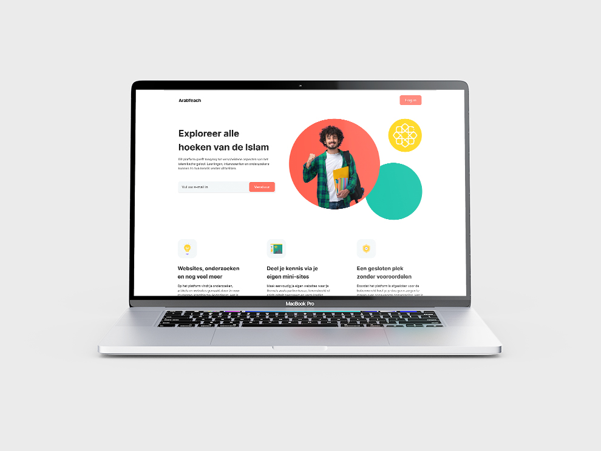

# IslamTeach - Educational platform



## Link to site

[https://islamteach.milanbauwens.be](https://islamteach.milanbauwens.be)

## Test Accounts 

#### Administrator / Teacher 

    email: administrator@islamteach.be
    password: secret

#### Student

    email: student@islamteach.be
    password: secret

###@ Reader

    email: reader@islamteach.be
    password: secret

## What is IslamTeach all about

IslamTeach is an application build as an educational environnement. It is made for students at Artevelde University of Applied Sciences who are studying the Islam.  

The app allows students to create, edit, and delete themed dossiers, view research dossiers, participate in educational escape rooms and much more. 
 
It is intended solely for educational purposes.


 #### Main features
- Public page with a register form 
- Themedossiers 
- Themedossier wizard
- Edu escape rooms
- Researchdossiers

## Authors

- [@milanbauwens](https://www.milanbauwens.be)


## Prerequisites

- PHP8.0
- MySQL

## Built with

- CraftCMS
- Composer
- MySQL

## Deployment

Clone the repository and go to {application directory} directory

```bash
git clone https://github.com/cms-development/werkstuk---edu-platform-milanbauwens.git

```

Generate .env file

```bash
cp .env.example .env
```

Then, configure the .env file according to your use case.

Install the dependencies

```bash
composer install
```

## License

Distributed under the [MIT](https://choosealicense.com/licenses/mit/) License. See LICENSE for more information.
